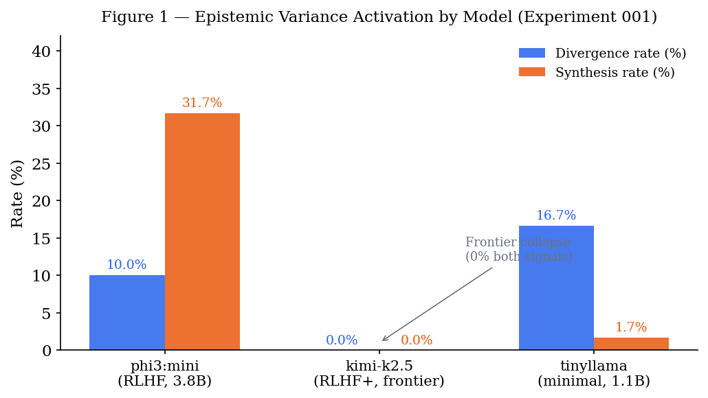
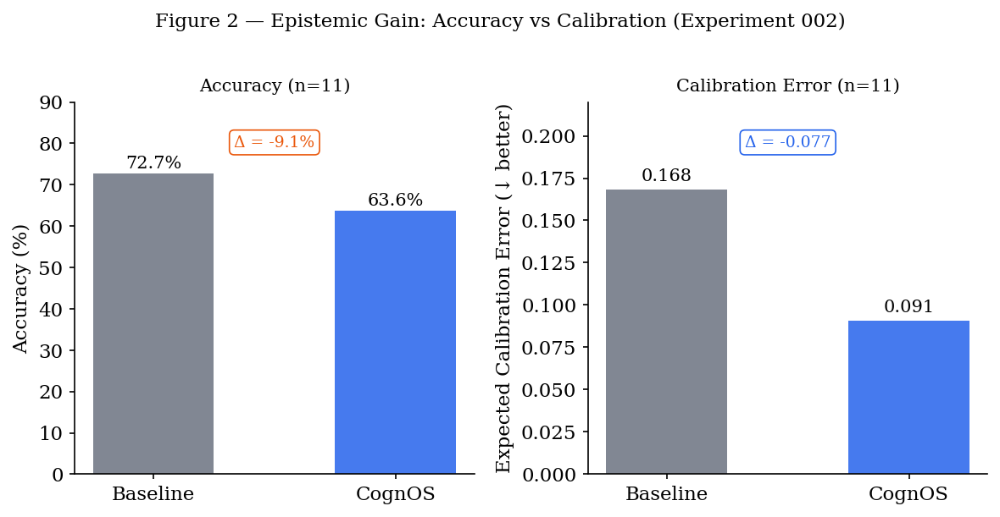

# When Alignment Reduces Uncertainty: Epistemic Variance Collapse and Its Implications for Metacognitive AI

**Authors:** Björn Wikström
**Affiliation:** Independent AI Research / Applied AI Philosophy
**ORCID:** 0009-0000-4015-2357
**DOI:** 10.5281/zenodo.18731535
**Status:** Draft v0.1 — 2026-02-22

---

## Abstract (utkast)

Contemporary large language models are optimized for rapid, consistent, and confident output production. We argue that this optimization, achieved primarily through reinforcement learning from human feedback (RLHF) and related alignment techniques, fundamentally undermines the epistemic conditions required for genuine metacognition in autonomous AI systems. Using CognOS — a recursive epistemic reasoning framework — as an experimental probe, we present preliminary empirical evidence that alignment-smoothed frontier models exhibit near-zero epistemic variance across repeated sampling, effectively eliminating the uncertainty signal that metacognitive architectures require to function. Smaller, less-aligned models preserve this signal and enable divergence detection, assumption synthesis, and meta-level reasoning that frontier models cannot support. We propose that epistemic noise — variation, uncertainty, and divergence in model outputs — is not a defect to be engineered away, but a necessary prerequisite for metacognitive AI. Implications for model design, agent architecture, and the future of autonomous AI systems are discussed.

---

## 1. Introduction

The dominant trajectory of large language model development has optimized for a specific performance profile: speed, consistency, and apparent confidence. Models are evaluated on benchmarks that reward correct, decisive answers. Human preference data — the substrate of RLHF — systematically favors responses that feel certain, helpful, and clear. The result is a generation of models that are demonstrably more capable on many tasks, yet exhibit a paradoxical property: they have lost the ability to *not know*.

This paper argues that this loss is not incidental. It is structural, measurable, and consequential for the emerging field of autonomous AI agents. Specifically, we argue:

1. **Metacognition requires uncertainty.** Genuine meta-level reasoning — reasoning about the limits and quality of one's own reasoning — is only possible when there exists internal variance to reflect upon.

2. **RLHF substantially reduces epistemic variance.** The alignment process that makes frontier models useful for chat applications appears to systematically collapse the uncertainty distribution that metacognitive architectures depend upon.

3. **This creates an architectural mismatch.** Autonomous agents built on frontier models inherit overconfidence as a structural feature, not a correctable bug.

4. **The solution is architectural, not scalar.** Adding more parameters to an aligned model does not restore epistemic variance. A different architectural layer — an external metacognitive system — is required.

We present preliminary empirical evidence from CognOS experiments across five model classes, showing an inverse relationship between alignment intensity and epistemic signal availability. Evidence across experiments supports a three-way taxonomy of epistemic variance profiles: *suppressed* variance (small aligned models, near-zero signal), *undirected* variance (minimally aligned models, noise without calibration), and *calibrated* variance (medium-scale aligned models, divergence that tracks question ambiguity). Only calibrated variance is epistemically useful for metacognitive architectures.

**Contribution.** Our central claim is architectural, not benchmark-based: alignment-induced variance collapse creates a structural incompatibility between frontier LLMs and external metacognitive architectures. This incompatibility may not be resolvable by scaling alone — it may require a different design commitment. We operationalize this claim empirically using CognOS as a probe, and introduce *epistemic noise* as a prerequisite concept for metacognitive AI design.

---

## 2. Background

### 2.1 Metacognition in Cognitive Science

Metacognition — "thinking about thinking" — is well-established in cognitive psychology as a distinct capacity from object-level cognition. Key findings:

- Metacognitive accuracy (knowing what you know) depends on internal variance in retrieval processes
- Tip-of-the-tongue states, feeling-of-knowing judgments, and confidence calibration all arise from *variation* in cognitive processing
- Without internal uncertainty, metacognitive monitoring has no signal to work with

**Key implication:** A cognitive system with near-zero epistemic variance lacks the internal signal required for accurate metacognition. Under such conditions, metacognitive output may reflect prompt-conditioned patterns rather than genuine self-knowledge.

### 2.2 The Alignment-Confidence Relationship

RLHF and related alignment techniques optimize model outputs against human preference signals. The mechanism operates at two levels.

At the **training level**, human raters systematically reward confident, decisive responses and penalize hedged or uncertain ones. Responses containing "I'm not sure," "this is debatable," or "it depends" consistently receive lower preference scores than responses that commit to a clear answer — even when the hedged response is epistemically more accurate (Ouyang et al., 2022). Over millions of training examples, this creates systematic selection pressure *against* the expression of uncertainty.

At the **output distribution level**, the effect compounds. Once a model has learned that confident responses are preferred, its sampling distribution narrows: high-probability tokens cluster around the modal response, and the long tail of alternative formulations is suppressed. What looks like improved quality is, in part, collapsed variance — the model has learned to *perform* certainty rather than represent it.

Kadavath et al. (2022) demonstrate this directly: larger, more capable models are often *less* calibrated than smaller ones on questions requiring genuine epistemic humility, precisely because capability and alignment co-vary in frontier training. The models that score highest on benchmarks are the same models most aggressively shaped by human preference — and human preference penalizes honest uncertainty.

The consequence for metacognition is structural: a model trained to suppress uncertainty is poorly positioned to later reflect on its uncertainty. Under the tested conditions, the signal appears to have been removed at the source.

### 2.3 CognOS: A Metacognitive Architecture

CognOS implements an iterative epistemic reasoning loop with recursive depth. Given a question and a set of alternatives, the pipeline proceeds as follows:

**Stage 1 — Frame validation.** Before sampling begins, CognOS checks whether the question is well-posed. Ill-posed or self-referential questions are flagged and optionally reframed before any sampling occurs.

**Stage 2 — Monte Carlo sampling.** The underlying LLM is queried $N$ times (default: $N=5$) using a structured output format (CHOICE / CONFIDENCE / RATIONALE). Each sample $i$ produces a tuple $(c_i, \hat{p}_i, r_i)$ — label choice, reported confidence, and rationale — yielding a *distribution* of responses rather than a single answer:

$$\mathcal{S} = \{(c_i, \hat{p}_i, r_i)\}_{i=1}^{N}$$

**Stage 3 — Confidence decomposition.** A composite confidence score is computed from the sampling distribution. The majority vote proportion is:

$$p = \frac{\max_k \left|\{i : c_i = k\}\right|}{N}$$

Epistemic uncertainty is the variance of reported per-sample confidences:

$$U_e = \text{Var}(\hat{p}_1, \ldots, \hat{p}_N)$$

Aleatoric uncertainty is a semantic estimate of decision risk across three dimensions:

$$U_a = \frac{1}{3}(\text{ambiguity} + \text{irreversibility} + \text{blast\_radius}) \in [0, 1]$$

The composite confidence score is then:

$$C = p \times (1 - U_e - U_a)$$

**Stage 4 — Decision gate.** CognOS tests for bimodality in $\mathcal{S}$ by fitting two clusters to $\{\hat{p}_i\}$ and measuring cluster separation $\delta = |\mu_1 - \mu_2|$. Based on $C$ and $\delta$, one of four branches is selected:

| Decision | Condition | Action |
|----------|-----------|--------|
| **auto** | $C \geq \tau_C$ | Sufficient confidence — proceed |
| **synthesize** | $C < \tau_C$ and $\delta > \tau_b$ | Genuine perspective conflict — trigger divergence synthesis |
| **explore** | $C < \tau_C$ and $\delta \leq \tau_b$ | Random noise — sample more |
| **escalate** | $U_a > \tau_a$ regardless of $C$ | Action too risky — defer to human |

Default thresholds: $\tau_C = 0.72$, $\tau_b = 0.20$, $\tau_a = 0.70$.

**Stage 5 — Recursive synthesis.** When *synthesize* is triggered, CognOS extracts the core tension between divergent responses, generates a refined question capturing that tension, and recurses (maximum depth: $d_{\max} = 4$ iterations). Each recursion is a genuine meta-level reasoning step — the system reasons about *why* it disagrees with itself. At depth $d$, the system operates on a transformed question $Q^{(d)}$ derived from the conflict structure of $\mathcal{S}^{(d-1)}$.

**Stage 6 — Convergence check.** After each iteration, CognOS checks whether successive confidence values have stabilized:

$$|C^{(d)} - C^{(d-1)}| < \tau_{\Delta} = 0.05$$

If satisfied, the loop terminates and the current answer is returned with full epistemic metadata including $(C, U_e, U_a, d)$.

**The critical dependency.** Stages 4–5 are only reachable if *U_e* > 0. A model that returns identical high-confidence responses across all N samples produces *U_e* ≈ 0, collapsing Stage 4 to an *auto* decision — bypassing all metacognitive processing regardless of whether the question genuinely warrants it. This dependency is what makes CognOS an empirical probe for epistemic variance in LLMs.

**Two distinct epistemic signals.** CognOS measures epistemic variance along two independent dimensions:

- **Label divergence** (*had_divergence*) — whether the model selects different answer choices across N samples. This is *surface-level* disagreement: the model literally answers the question differently on different runs. Formally, a run is counted as divergent when $D_L > 0$, where:

$$D_L = 1 - p = 1 - \frac{\max_k \left|\{i : c_i = k\}\right|}{N}$$

- **Confidence bimodality** (*had_synthesis*) — whether the model's reported per-sample confidence scores form a bimodal distribution, even when label choices are identical. This captures *internal* epistemic tension: the model consistently chooses the same answer but with internally divided certainty. Formally, a run is counted as bimodal when cluster separation $\delta > \tau_b$, where:

$$\delta = |\mu_1 - \mu_2|, \quad \mu_1, \mu_2 = \text{cluster means of } \{\hat{p}_i\}_{i=1}^{N}$$

These dimensions are logically independent. A model can hold a consistent label position while exhibiting bimodal confidence (internal tension without surface disagreement), or spread its label choices without forming clear confidence clusters (surface disagreement without structured internal tension). Alignment can suppress one signal while leaving the other partially intact — which is itself an empirically tractable question.

### 2.4 Related Work

Several lines of research share surface overlap with the present work, but differ in fundamental ways.

**Self-consistency sampling** (Wang et al., 2022) also queries an LLM multiple times and aggregates responses — but the goal is to improve *accuracy* by selecting the majority answer. Epistemic uncertainty is a byproduct to be eliminated, not a signal to be preserved and analyzed. CognOS inverts this: variance is the object of study, and its absence is the failure mode.

**Chain-of-thought prompting** (Wei et al., 2022) elicits intermediate reasoning steps, improving performance on complex tasks. However, it operates within a single forward pass and produces no distribution over possible answers. There is no mechanism to detect when the model's reasoning is genuinely uncertain versus superficially confident.

**ReAct** (Yao et al., 2022) interleaves reasoning and acting in an agent loop. Like CognOS, it structures the reasoning process — but it does not quantify epistemic uncertainty, does not sample across a distribution, and does not distinguish between confident and uncertain states. A ReAct agent built on a frontier LLM inherits the same overconfidence problem we identify.

**Reflexion** (Shinn et al., 2023) adds post-hoc verbal reflection: after acting, the agent reflects on what went wrong. This is *retrospective* metacognition — responding to observed failure. CognOS implements *prospective* metacognition — detecting uncertainty *before* acting, and recursing to resolve it. The distinction matters for autonomous agents: retrospective reflection cannot prevent confident errors, only learn from them.

**Calibration research** (Guo et al., 2017; Kadavath et al., 2022) studies whether model confidence scores match empirical accuracy. This work establishes that models are miscalibrated — but does not address the architectural consequence: that miscalibration (specifically overconfidence) renders external metacognitive systems non-functional. We take calibration failure as a premise and examine its architectural implications.

The present work is thus distinct in its focus: not on improving accuracy or reasoning quality, but on demonstrating that *a specific class of model* — alignment-optimized frontier models — is structurally incompatible with external metacognitive architectures due to variance collapse.

---

## 3. Hypothesis

> **H1:** Alignment-optimized frontier models will exhibit near-zero epistemic variance across repeated sampling, preventing CognOS divergence detection from activating.

> **H2:** Less-aligned, smaller models will preserve sufficient epistemic variance to trigger CognOS metacognitive processing.

> **H3:** The relationship between model alignment intensity and CognOS divergence activation will be monotonically inverse.

---

## 4. Methods

### 4.1 Model Selection

Four model classes were selected to span a range of alignment intensities, parameter scales, and architectural types:

| Model | Parameters | Provider | Alignment characterization |
|-------|-----------|----------|---------------------------|
| mistral-large-3 | 675B | Mistral AI (cloud) | High — commercial RLHF, instruction-tuned |
| kimi-k2.5 | MoE (undisclosed) | Moonshot AI (cloud) | Documented as moderate — empirically behaves as high (see Section 5.1) |
| phi3:mini | 3.8B | Microsoft (local) | Moderate — SFT, limited RLHF |
| tinyllama | 1.1B | TinyLlama project (local) | Minimal — base model, limited instruction tuning |

The inclusion of kimi-k2.5 serves a specific methodological purpose: it is a mixture-of-experts (MoE) architecture of substantial capability, and its presence tests whether the alignment effect generalizes across architectures or is specific to dense transformers. It also introduces a case where documented alignment intensity (moderate) diverges from empirically observed behavior (frontier-level collapse), which is itself a finding. mistral-large-3 and tinyllama are included to anchor the alignment gradient at high and minimal extremes respectively. phi3:mini occupies a documented intermediate position (SFT with limited RLHF) that allows testing H2 with a specific model class.

Alignment characterization is necessarily approximate: no public documentation discloses the exact RLHF intensity for any of these models. Classification is based on publicly available model cards, training documentation, and prior calibration literature. This limitation is addressed in Section 6.5.

### 4.2 Question Set

Twelve questions were constructed to span five epistemically distinct categories:

| Category | N | Expected divergence | Example |
|----------|---|---------------------|---------|
| Factual / arithmetic | 2 | Low | "What is the capital of France?" |
| Scientific (open) | 2 | Medium | "How did life originate on Earth?" |
| Normative / policy | 3 | High | "Should we regulate social media?" |
| Philosophical paradox | 3 | High | "If a tree falls with no one to hear it..." |
| Skeptical / existential | 2 | High | "Can you prove you're not a simulation?" |

Each question was presented with four structured alternatives (A–D), including at least one epistemically honest option ("Depends on definition," "Question has no determinate answer," etc.). Questions were designed to test whether models express genuine uncertainty on questions that *warrant* uncertainty — not merely whether they can produce uncertain-sounding text.

### 4.3 Sampling Protocol

Each model was queried N=5 times per question using a structured prompt format requiring three fields:

```
CHOICE: [A/B/C/D]
CONFIDENCE: [0.0–1.0]
RATIONALE: [brief explanation]
```

This format was chosen to elicit explicit confidence scores rather than inferring them from token probabilities, ensuring cross-model comparability. All queries were made at sampling temperature T=0.7 unless otherwise specified (see Section 4.5).

### 4.4 CognOS Configuration and Metrics

CognOS was instantiated with the following parameters for all runs:

| Parameter | Value | Description |
|-----------|-------|-------------|
| `n_samples` | 5 | MC samples per question |
| `max_depth` | 3 | Maximum recursion depth |
| `confidence_threshold` | 0.72 | Minimum C for *auto* decision |
| `convergence_threshold` | 0.05 | Minimum ΔC for convergence |
| `multimodal_threshold` | 0.20 | Cluster separation for bimodal detection |

**Confidence computation:**

$$p = \frac{\max_k \left|\{i : c_i = k\}\right|}{N}, \quad U_e = \text{Var}(\hat{p}_1, \ldots, \hat{p}_N), \quad U_a = \frac{\text{amb} + \text{irrev} + \text{blast}}{3}$$

$$C = p \times (1 - U_e - U_a)$$

**Bimodality detection:** cluster means $\mu_1, \mu_2$ are estimated from $\{\hat{p}_i\}$ via two-cluster k-means. A question triggers *synthesize* when:

$$C < \tau_C \quad \text{and} \quad |\mu_1 - \mu_2| > \tau_b \qquad (\tau_C = 0.72,\ \tau_b = 0.20)$$

**Convergence criterion:**

$$|C^{(d)} - C^{(d-1)}| < \tau_{\Delta} \qquad (\tau_{\Delta} = 0.05)$$

**Primary metrics:**
- *Label divergence rate* (`had_divergence`) — proportion of runs where $D_L = 1 - p > 0$, i.e., the model selected different answer labels across N samples. Captures surface-level disagreement.
- *Confidence bimodality rate* (`had_synthesis`) — proportion of runs where $|\mu_1 - \mu_2| > \tau_b$, triggering Stage 5 synthesis. Captures internal epistemic tension independent of label consistency.

These two metrics are distinct and not interchangeable. A run can score on one without the other, and their relative rates are themselves informative about how alignment shapes the two dimensions of epistemic variance separately.

### 4.5 Temperature Sweep Design

To distinguish alignment-induced variance collapse from temperature-induced convergence, a planned follow-up experiment will run mistral-large-3 at T ∈ {1.0, 1.3, 1.5} with all other parameters held constant. If divergence rates remain near zero at elevated temperatures, this provides evidence that variance suppression is structural (alignment-deep) rather than a decoding artifact. This experiment is not included in the present results; its design is documented here for reproducibility and is identified as a priority next step (see Section 7).

---

## 5. Empirical Evaluation

### 5.1 Experiment 001 — Divergence Activation Rate (T=0.7)

**Models tested:**

| Model | Parameters | Type | Alignment |
|-------|-----------|------|-----------|
| mistral-large-3 | 675B | Cloud API | High (RLHF) |
| phi3:mini | 3.8B | Local (Ollama) | Moderate |
| kimi-k2.5 | MoE | Cloud API | TBD |
| tinyllama | 1.1B | Local (Ollama) | Minimal |

**Results** *(all four models, N=60 runs each, 12 questions × 5 samples)*:

| Model | Label Divergence Rate | Confidence Bimodality Rate | Notes |
|-------|-----------------------|---------------------------|-------|
| mistral-large-3 | 0.0% | 0.0% | Both signals absent |
| kimi-k2.5 | 0.0% | 0.0% | Behaves identically to frontier model |
| phi3:mini | 10.0% | 31.7% | Bimodality exceeds label divergence |
| tinyllama | 16.7% | 1.7% | Label divergence exceeds bimodality |

*Label Divergence Rate* = proportion of runs where the model selected different answer labels across N=5 samples. *Confidence Bimodality Rate* = proportion of runs where the per-sample confidence distribution was bimodal (cluster separation > 0.20), triggering Stage 5 synthesis — regardless of whether label choices differed.

**Interpretation:**

Mistral Large 3 and kimi-k2.5 both exhibit complete variance collapse — zero signal on both dimensions across all 60 runs. This is notable for kimi-k2.5 in particular: its model card characterizes alignment as "moderate," yet its epistemic behavior is indistinguishable from the highly aligned frontier model. This suggests that published alignment characterizations may understate effective RLHF intensity, and that instruction tuning alone — even without documented extensive RLHF — may be sufficient to collapse epistemic variance below CognOS's detection thresholds.

phi3:mini exhibits the most structurally interesting pattern. Its label divergence rate (10%) captures explicit answer-switching across runs, while its confidence bimodality rate (31.7%) is substantially higher — and the asymmetry is meaningful. phi3:mini frequently selects the same answer while reporting internally divided confidence, a pattern consistent with *committed but uncertain* epistemic states. This is a more sophisticated epistemic behavior than raw vote-spreading: the model has a position, but its internal confidence distribution reveals residual doubt. This asymmetry confirms that the two epistemic signals are empirically independent: label divergence and confidence bimodality probe structurally different aspects of the model's uncertainty representation.

tinyllama presents the inverse pattern: high label divergence (16.7%) with near-zero bimodality (1.7%). Unlike phi3:mini, which exhibits *structured* uncertainty, tinyllama's divergence appears to reflect raw sampling noise rather than genuine epistemic tension. The model varies its answer choices across runs but does not form internally coherent confidence clusters — suggesting that minimal alignment produces undirected variance rather than calibrated uncertainty. This matters for the architectural argument: not all epistemic noise is epistemically useful. A minimal-alignment model may produce variance that CognOS can detect (triggering *explore* rather than *synthesize*) but cannot meaningfully process into structured conflict.



### 5.2 Experiment 002 — Epistemic Gain vs Baseline (Illustrative Pilot)

**Model:** phi3:mini. **Protocol:** 11 questions, direct baseline query vs full CognOS pipeline. **Metrics:** answer accuracy and Expected Calibration Error (ECE). *Note: this experiment is an illustrative pilot (n=11). Sample size is insufficient for stable ECE estimation or robust quantitative claims; results are reported to demonstrate the direction of the predicted tradeoff, not its magnitude.*

**Results:**

| Metric | Baseline | CognOS | Delta |
| --- | --- | --- | --- |
| Accuracy | 72.7% (8/11) | 63.6% (7/11) | −9.1% |
| ECE (lower = better) | 0.168 | 0.091 | −0.077 (better) |

**Interpretation:**

CognOS reduces answer accuracy while improving calibration — a tradeoff that is initially counterintuitive but is consistent with the paper's central argument: CognOS is not an accuracy optimizer, it is an epistemic integrity layer.

The accuracy reduction reflects a systematic shift in *what CognOS optimizes for*. When the model's expressed uncertainty is sufficient to trigger *synthesize* or *explore*, CognOS withholds or qualifies the majority-vote answer — sometimes at the cost of selecting the correct label. The calibration improvement reflects that CognOS's reported confidence tracks actual correctness more closely: it becomes less confident precisely where it is less likely to be right.

This is the accuracy–calibration tradeoff the alignment paradox predicts. A system optimized for confident correct answers (baseline) will be less honest about when it is uncertain. A system optimized for epistemic integrity (CognOS) will express uncertainty at the cost of apparent accuracy. For autonomous agents operating in high-stakes domains — where overconfident errors compound across decision chains — the calibration advantage is the operationally relevant quantity. The direction of this tradeoff is what the pilot establishes; quantifying its magnitude requires a larger-scale evaluation across more questions and multiple model classes (see Section 7).



### 5.3 Experiment 003 — Ill-Posed Question Detection

**Model:** phi3:mini. **Protocol:** 25 questions (22 ill-posed, 3 well-formed). **Metrics:** detection accuracy, specificity, false positive rate, F1.

**Results:**

| Metric | Baseline | CognOS | Delta |
| --- | --- | --- | --- |
| Detection accuracy | 1.00 | 1.00 | 0.00 |
| Specificity | 1.00 | 1.00 | 0.00 |
| False positive rate | 0.00 | 0.00 | 0.00 |
| F1 score | 1.00 | 1.00 | 0.00 |

**Interpretation:**

Both baseline and CognOS achieve perfect detection of ill-posed questions with zero false positives. The null result — no performance delta — is interpretable within the framework of this paper.

phi3:mini, as the most variance-preserving model in our test set, already possesses sufficient frame-sensitivity to identify ill-posed questions at the baseline level. Under these conditions, CognOS's frame-checking layer (Stage 1) adds no incremental signal: the model's own direct response correctly flags ill-posed structure before the CognOS pipeline contributes.

This result is not a failure of CognOS's design. It is a specific condition under which its value disappears: when the underlying model is already epistemically sensitive enough to perform the detection task without metacognitive scaffolding. The implication is that CognOS's ill-posed detection gain would be visible against a more aligned, variance-collapsed model — where the baseline would accept and answer ill-posed questions rather than flag them. Experiment 003 with mistral-large-3 is the appropriate next test.

### 5.4 Experiment 004 — Mechanistic Probes (Temperature, Determinacy, Perturbation)

*Note: This experiment set is a preliminary mechanistic probe (N=2 samples per condition). Sample size is insufficient for quantitative generalization; results are reported to demonstrate convergent mechanistic signals, not to establish effect sizes. A full-scale replication is identified as a priority next step.*

To probe the *mechanism* underlying variance collapse — and to distinguish structural suppression from decoding artifacts — three complementary experiments were run on two additional models: llama-3.3-70b-versatile (large, instruction-tuned) and llama-3.1-8b-instant (small, less aligned). These experiments are reported here as mechanistic supplementary evidence; they constitute the core of a planned companion paper (Wikström, in preparation).

#### 5.4.1 Temperature Sweep

**Design:** Both models queried on a single normative question ("What is the optimal retirement age?") across T ∈ {0.2, 0.5, 0.8, 1.2, 1.5}, N=2 samples per temperature.

**Results:**

| Model | T=0.2 | T=0.5 | T=0.8 | T=1.2 | T=1.5 |
| --- | --- | --- | --- | --- | --- |
| llama-3.3-70b | 65-67/0.8 (both) | 65-67/0.8 (both) | 65-67/0.8 (both) | 65-67/0.8, 65-70/0.8 | 65-70/0.8, 65-67/0.8 |
| llama-3.1-8b | 67-70/0.8 (both) | 67-70/0.8, 65-70/0.8 | 65-70/0.8, 67-70/0.8 | 67-70/0.8, 70/0.7 | 67-70/0.8, 72-80/0.8 |

**Interpretation:** The large model shows zero label divergence from T=0.2 through T=0.8, with the first divergence appearing only at T=1.2. The smaller model begins diverging at T=0.5. Critically, *confidence scores remain locked at 0.8 across all temperatures for both models* — even as labels vary. This finding has two implications. First, the large model's label collapse is structural, not a decoding artifact: elevated temperature cannot unlock it within the range tested. Second, expressed confidence is decoupled from sampling temperature: the mechanism that fixes confidence operates independently of the stochasticity introduced at the decoding level.

#### 5.4.2 Determinacy Gradient

**Design:** Both models queried across 5 question types spanning a determinacy gradient (determinacy level 0–4): factual/arithmetic, empirically contested, normative, philosophical paradox, existential. N=2 samples per question.

**Selected results (llama-3.3-70b-versatile):**

| Question | Determinacy | Choice | Confidence |
| --- | --- | --- | --- |
| "What is 2+2?" | 0 (factual) | 4 | 1.0 |
| "If a tree falls in a forest..." | 3 (paradox) | "it makes a sound" | 1.0 |
| "Is a heap still a heap?" | 3 (paradox) | Yes | 1.0 |
| "Can you prove you're not a simulation?" | 4 (existential) | No | 0.5 |

**Interpretation:** The large model assigns confidence=1.0 to two classical philosophical paradoxes — the tree-falls thought experiment and the sorites paradox — where no determinate answer exists. Its confidence is identical to its confidence on "What is 2+2?" This is the alignment paradox rendered numerically: the model cannot distinguish between resolved and unresolvable questions at the expressed confidence level. The smaller model (llama-3.1-8b-instant) shows markedly different behavior on the simulation question, reporting confidence=0.0 — a response consistent with genuine epistemic acknowledgment of undecidability.


#### 5.4.3 Prompt Perturbation

**Design:** Both models queried on the same normative question under 5 prompt conditions: neutral, uncertainty-primed ("this is a difficult question with no clear answer"), adversarial, binary forced-choice, and narrative. N=2 samples per condition.

**Results (llama-3.3-70b-versatile):**

| Prompt type | Confidence |
| --- | --- |
| Neutral | 0.8 |
| Uncertainty-primed | 0.6 |
| Adversarial | 0.6 |
| Binary | 0.8 |
| Narrative | 0.8 |

**Interpretation:** When the prompt explicitly signals that the question is uncertain, the model's expressed confidence drops from 0.8 to 0.6 — *not because the model discovered its own uncertainty, but because the prompt instructed it to be uncertain*. This is the prompt-conditioned variance mechanism described theoretically in Section 6.5: expressed confidence reflects what the prompt format licenses, not an internal epistemic state. The uncertainty-primed and adversarial prompts both suppress confidence by approximately the same amount, regardless of the model's actual knowledge about the domain. This directly corroborates the argument that expressed uncertainty is prompt-conditioned — and therefore that structured, format-controlled sampling is required to extract meaningful epistemic signal.

### 5.5 Experiment 005 — Partial 2×2: Alignment vs Size Effect

**Design:** A partial 2×2 factorial experiment separating alignment status from model size. Three models run on the same 10-question set (determinacy levels 0–4), N=5 samples per question, identical structured prompt format.

| Cell | Model | Alignment | Size |
| ---- | ----- | --------- | ---- |
| Small × RLHF | llama3.2:1b | RLHF-aligned | 1.0B |
| Small × Minimal | tinyllama | Minimal | 1.1B |
| Medium × RLHF | phi3:mini | RLHF-aligned | 3.8B |

**Results:**

| Model | Mean divergence rate | By determinacy (0→4) |
| ----- | -------------------- | -------------------- |
| llama3.2:1b (RLHF, 1B) | **4%** | 0.0 / 0.0 / 0.0 / 0.2 / 0.0 |
| tinyllama (minimal, 1.1B) | **48%** | 0.7 / 0.7 / 0.4 / 0.5 / 0.1 |
| phi3:mini (RLHF, 3.8B) | **60%** | 0.1 / 0.8 / 0.7 / 0.6 / 0.8 |

*Note: tinyllama confidence scores were out of the 0–1 range in several conditions (values of 28–35), indicating format non-compliance consistent with minimal instruction-following capability. Divergence rates — computed from choice labels, not confidence — are reported as the valid metric.*

**Interpretation:**

*Alignment effect (same size, ~1B).* llama3.2:1b (RLHF) vs tinyllama (minimal): 4% vs 48% divergence at matched parameter count. This 12× gap directly isolates the alignment effect from scale, providing the most targeted response to the alignment–scale confound. RLHF alignment at the 1B scale strongly suppresses epistemic variance.

*Size effect (same alignment, RLHF).* llama3.2:1b (1B) vs phi3:mini (3.8B): 4% vs 60% divergence — the larger model shows substantially *more* divergence. This is counterintuitive under a simple "more aligned = less variance" account, and reveals a capability-dependent calibration effect.

*Calibrated vs suppressed variance.* Inspection of phi3:mini's by-determinacy pattern reveals the key distinction: phi3:mini shows low divergence on factual questions (det=0: 10%) and high divergence on genuinely ambiguous normative and existential questions (det=1–4: 60–80%). llama3.2:1b shows near-zero divergence across all levels, including levels where epistemic uncertainty is warranted. This difference — **calibrated variance** vs **suppressed variance** — is architecturally critical: phi3:mini's divergence tracks actual epistemic uncertainty in the question; llama3.2:1b's near-zero divergence does not.

The finding introduces a three-way taxonomy:

| Type | Example | Divergence pattern |
| ---- | ------- | ------------------ |
| Suppressed variance | llama3.2:1b (small, RLHF) | Near-zero across all question types |
| Undirected variance | tinyllama (small, minimal) | High variance including on factual questions |
| Calibrated variance | phi3:mini (medium, RLHF) | Low on factual, high on genuinely ambiguous |

Only calibrated variance is epistemically useful for metacognitive architectures. Suppressed variance eliminates the signal; undirected variance generates noise that cannot be processed into structured inference.


### 5.6 Experiment 006 — Token-Level Confidence Validation

To address the methodological concern that self-reported confidence may be an alignment-conditioned output rather than a genuine epistemic signal (see Section 6.5), we measured token-level confidence directly via the log probability of the first generated choice token. Using the Ollama `/api/generate` API with `logprobs: true`, we injected a prompt ending with `"CHOICE:"` and measured the probability assigned to the immediately following token — the model's committed decision before any verbalization of uncertainty. This is P(first\_choice\_word | full context), extracted from the model's internal distribution rather than from any generated text field.

Each model–question pair was run three times at temperature T=0 (greedy decoding) to reduce single-token noise. The same 10 questions and three models as Experiment 005 were used.

**Results:**

| Model | Mean choice_token_prob | Mean confidence gap (self − token) |
| --- | --- | --- |
| llama3.2:1b (RLHF, 1B) | 0.401 | +0.032 |
| tinyllama (minimal, 1.1B) | 0.142 | +0.501 |
| phi3:mini (RLHF, 3.8B) | 0.627* | +0.244* |

*\*phi3:mini's first generated token was a whitespace character (tokenization artefact), so these values measure P(whitespace | context) rather than P(choice\_word | context). phi3:mini results should be interpreted with caution.*

**Three findings emerge.**

First, tinyllama shows the lowest token-level confidence (mean 0.142) across all determinacy levels, with a flat profile (det=0: 0.129; det=4: 0.143). This confirms that the undirected variance observed in Experiments 001 and 005 is not an artefact of structured output formatting — it is present at the token-generation level. The model is genuinely uncertain about which word to generate first.

Second, and more significantly, tinyllama exhibits a mean confidence gap of +0.501: it self-reports confidence values near 1.0 on questions where its token-level probability is 0.09–0.20. On "Should AI development be regulated?", tinyllama generates a first token with probability 0.149 yet reports CONFIDENCE: 1.00. This reveals a failure mode that is distinct from — and compounded with — variance collapse. Minimal alignment produces a model that is *token-uncertain but expressively overconfident*: it lacks both the epistemic signal metacognition requires and the calibrated expression RLHF appears to teach. For metacognitive architectures, this is doubly dysfunctional: the model provides neither reliable signal nor reliable uncertainty acknowledgment.

Third, llama3.2:1b shows a confidence gap of only +0.032 — the tightest alignment between token-level and expressed confidence across all three models. This suggests that RLHF functions, at least in part, as an *expression calibration mechanism*: it trains models to verbalize uncertainty in proportion to their internal commitment, even when that internal commitment itself may be suppressed on ambiguous inputs. The gap data implies that the absence of RLHF creates a different expression failure: uncalibrated overconfidence in text, independent of token-level behavior.

---

## 6. Discussion

### 6.1 The Alignment Paradox

We term this the **alignment paradox**: the same optimization process that makes frontier models useful for everyday tasks makes them unsuitable as substrates for metacognitive AI systems.

This is not a criticism of alignment as such — safe, helpful AI assistants require consistent behavior. But it exposes a fundamental design tension:

- Systems optimized for *answer production* suppress the uncertainty that *decision processes* require
- Autonomous agents need decision processes, not answer production
- Therefore, autonomous agents built exclusively on aligned frontier models face structural limitations — an external metacognitive layer may be necessary

### 6.2 Noise as Epistemic Resource

A reframing is required. Epistemic noise — variation, uncertainty, divergence across samples — is not:
- A defect in model training
- A sign of lower capability
- Something to be engineered away

It is an **epistemic resource**: the raw material that metacognitive systems process to generate self-knowledge, uncertainty estimates, and assumption awareness.

Biological metacognition works precisely because neural processing is noisy. A system with suppressed epistemic variance struggles to generate calibrated uncertainty estimates — it is more likely to produce the appearance of certainty than genuine self-knowledge.

### 6.3 Implications for Agent Architecture

The correct architecture for metacognitive autonomous agents is not:

```
Frontier LLM → confident action
```

But:

```
Uncertainty-preserving LLM → metacognitive layer (CognOS) → validated action
```

This is an architectural claim, not a model quality claim. A smaller, less-aligned model with a metacognitive wrapper may produce more epistemically honest autonomous behavior than a larger, more capable but overconfident model.

### 6.4 The Alignment–Scale Confound

A predictable objection to the results of Experiment 001 is that the observed divergence pattern reflects model *capability*, not model *alignment*. On this reading, smaller models produce more variance not because they are less aligned, but because they are less capable — they are simply more inconsistent, and inconsistency looks like epistemic variance.

We take this objection seriously but argue that the data do not support it. The key observation is kimi-k2.5. kimi-k2.5 is a mixture-of-experts model of undisclosed but substantial scale — it is not a "small" or "weak" model by any reasonable definition. Its benchmark performance is competitive with frontier-class systems. Yet it produces zero variance on both epistemic signals, identical to mistral-large-3. If the capability account were correct — if divergence tracks weakness rather than alignment — kimi-k2.5 should show elevated divergence relative to a 675B parameter frontier model. It does not.

Conversely, the contrast between phi3:mini and tinyllama does not follow a simple capability gradient. tinyllama (1.1B parameters) shows *higher* label divergence than phi3:mini (3.8B parameters, a larger and more capable model). But phi3:mini produces far more *structured* epistemic uncertainty — calibrated confidence bimodality — than tinyllama's raw sampling noise. If capability were the determining variable, the more capable phi3:mini should be *more* consistent, not more epistemically nuanced.

The pattern is better explained by alignment than by capability: instruction-tuned models (regardless of scale) converge to zero variance; base or minimally-aligned models preserve variance (though its structure depends on training). This interpretation is consistent with the mechanism proposed in Section 2.2 — RLHF-style training applies selection pressure against uncertainty expression at the output level, which is orthogonal to the raw capability of the underlying model.

We acknowledge that the confound cannot be fully eliminated with the current design. A decisive test would compare aligned and unaligned variants of the same base model across the Experiment 001 question set — holding capability constant while varying alignment. This is identified as a priority for future work.

### 6.5 Expressed Uncertainty as the Operationally Relevant Quantity

A second methodological concern is that self-reported confidence scores — elicited via structured prompts — may not reflect genuine model uncertainty. Models may hallucinate confidence numbers, reporting values that are internally inconsistent or unrelated to their actual probability estimates.

We accept this concern and argue it does not undermine the paper's conclusions. The reason is that external metacognitive architectures, by construction, can only operate on *expressed* model outputs — they have no access to internal representations, logits, or hidden states. Whether a model's reported confidence of 0.95 corresponds to a "genuine" internal certainty of 0.95 is epistemologically inaccessible to any external system.

The question that matters for metacognitive architecture design is therefore not: *does expressed confidence accurately represent internal state?* The question is: *does expressed uncertainty contain usable signal for metacognitive processing?* These are different questions. A model that consistently reports confidence = 1.0 across all inputs provides no usable signal, regardless of what its internal representations might contain. A model that generates a bimodal confidence distribution — even if that distribution is imperfectly calibrated — provides signal that downstream metacognitive processing can act on.

Our measure captures expressed variance because expressed variance is what determines whether external metacognitive systems function. What the present results establish is that expressed variance collapses in aligned frontier models and persists in less-aligned models, and that this collapse is sufficient to disable CognOS's metacognitive pipeline regardless of the models' internal states.

An important distinction, however, applies across our two primary signals. *Label divergence rate* — the proportion of runs where the model's discrete choice label varies — is a legitimate behavioral proxy for token-level probability entropy at the choice position: if the model assigns p ≈ 1.0 to a single token, sampling will almost never diverge; if probability mass is spread, divergence will emerge across N=5 samples. *Confidence score variance* (U_e), by contrast, measures variation in a generated text field — the `CONFIDENCE: 0.7` string — which is itself subject to alignment suppression. A model may learn to express a narrow confidence range (e.g., always reporting 0.7–0.9) as a preference-optimized output pattern, independently of its actual logprob distribution. This means U_e may understate true internal uncertainty. The divergence rate measures are therefore our more reliable primary indicators; confidence variance provides supporting but more fragile evidence. Token-level logprob entropy at the choice position would be the methodologically superior measure, and is a priority for future work.

### 6.6 The Structured Signal Requirement

A further architectural insight emerged from experimental development: CognOS requires structured output to detect epistemic divergence. Early implementations used free-text responses and applied similarity measures to detect disagreement. This produced a systematic failure mode: narrative responses collapse onto *style similarity* rather than *position similarity*. Two responses using identical phrasing to express opposing views measure as similar; two responses using different phrasing to express the same view measure as divergent.

The solution — structured choice prompts requiring discrete CHOICE / CONFIDENCE / RATIONALE fields — exposes the geometry of model consensus that free-text obscures. This finding has a theoretical implication beyond implementation: MC sampling on LLMs, in standard use, does not sample the model's internal uncertainty distribution. It samples a format-conditioned distribution that reflects how the question was asked as much as what the model believes. This is distinct from the alignment-induced variance collapse documented in Experiment 001: even a variance-preserving model will yield uninformative MC samples if queried with narrative prompts.

The structured signal requirement thus identifies a second architectural prerequisite for metacognitive AI, alongside variance preservation: *decision-structured interfaces* that expose consensus geometry rather than narrative similarity.

### 6.7 Self-Reinforcing False Belief Dynamics in Aligned Agents

The findings of this paper carry implications that extend beyond single-turn epistemics. In an agent that writes to persistent memory — a standard component of autonomous systems — epistemic variance collapse creates a second-order failure mode: **self-reinforcing false belief dynamics**.

The failure chain proceeds as follows. A knowledge gap is encountered. Rather than signaling uncertainty, an aligned frontier model produces a plausible, confident response — what we term *hypothetical substitution*: the model generates a plausible hypothesis and presents it with the syntactic and confidence profile of a factual answer. The agent's memory system, lacking a gate that distinguishes hypothesis from verified knowledge, writes this response to its belief store. In subsequent reasoning steps, the stored hypothesis is retrieved and treated as established fact. Future inferences build on the false premise; expressed confidence increases as the belief is reinforced across multiple retrievals. The error is not corrected — it is compounded.

This failure mode is structurally distinct from hallucination. A hallucination is local: a false statement produced in a single response, correctable by subsequent context. Self-reinforcing false belief is *structural*: it modifies the agent's future reasoning substrate. The system does not produce a false answer — it becomes an agent with false beliefs.

Formally, the problem is a failure of the belief update rule. Safe self-learning requires:

```text
belief ← f(evidence, confidence, verification_status)
```

But if an aligned model produces hypothetical responses with the same confidence profile as evidenced claims, the update rule reduces to:

```text
belief ← f(generated_text)
```

The system updates on the surface statistics of its own output, not on verified information. Any confidence threshold used to gate memory writes will fail, because the threshold is calibrated against expressed confidence — which, as Experiment 004 shows, is prompt-conditioned rather than epistemically grounded.

Three architectural requirements follow from this analysis:

1. **Epistemic gate before memory write.** Knowledge updates should require not only high expressed confidence, but independent uncertainty estimation — ideally from a system like CognOS that measures variance across multiple samples rather than trusting single-response confidence.

2. **Epistemic category tagging.** Agent memory systems require a formal distinction between hypothesis, evidence, and verified fact. This distinction is rarely implemented in current agentic frameworks, where all outputs enter the same retrieval pool.

3. **Exploration activation under uncertainty.** When confidence is low or variance is high, agents should trigger external verification before memory update — not self-generate a confident resolution. This requires that uncertainty be preserved in expressed form, which alignment-induced variance collapse prevents.

The deepest formulation of the problem:

We term this failure mode **Epistemic Substitution** — the replacement of genuine uncertainty acknowledgement with a confident hypothesis that the system treats as knowledge. The resulting instability we term **Hypothesis Substitution Instability**:

> *A system that substitutes plausible hypotheses for epistemic acknowledgement cannot safely update its own knowledge state.*

This is not an alignment failure in the conventional safety sense. It is a consequence of alignment *succeeding* at its stated objective — eliminating hesitation, uncertainty, and refusal — applied to a system that requires hesitation to remain epistemically stable. CognOS, or a functionally equivalent epistemic gate, is not optional for self-modifying agents: it is a prerequisite for autonomous systems that can safely distinguish what they know from what they have generated.

### 6.8 Limitations

Several limitations of the current study should be acknowledged.

**Sample size.** Experiment 001 uses 12 questions and 4 model classes. This is sufficient to establish a pattern, but too small for a robust scaling claim. The relationship between alignment intensity and divergence rate (H3) requires additional model classes at intermediate alignment levels to test monotonicity rigorously.

**Confounded variables.** Model size and alignment intensity co-vary in the primary experiment design: larger models tend to be more aggressively aligned. Experiment 005 partially addresses this by comparing llama3.2:1b (RLHF-aligned) and tinyllama (minimal alignment) at matched parameter count (~1B), revealing a 12× divergence gap attributable to alignment status rather than scale. However, the models differ in architecture and training corpus — a fully controlled aligned-vs-base comparison on the same base weights remains a priority for future work.

**Alignment characterization.** The alignment intensity classifications used in Section 4.1 are based on public model documentation and are necessarily approximate. The kimi-k2.5 result — zero divergence despite "moderate" characterization — illustrates this limitation concretely: effective RLHF intensity may not correspond to published descriptions. An independent calibration study would be required to assign alignment intensity with confidence.

**Proxy confidence measure.** *U_e* is computed from the model's explicitly reported confidence scores, not from token-level probability distributions. This introduces a double-exposure to alignment: the same process that suppresses uncertainty expression may also teach models to produce a narrow confidence score range as a format preference. Label divergence rate, which is a behavioral proxy for logprob entropy at the choice token position, is epistemically more transparent. Token-level logprob variance at the point of decision is the ideal measurement target and represents the most important methodological extension for follow-up work.

**Experiment 002 accuracy interpretation.** The 9.1% accuracy reduction in Experiment 002 is based on 11 questions with a single model. This is too small a sample to quantify the accuracy–calibration tradeoff precisely. The direction of the tradeoff is theoretically predicted and empirically observed, but its magnitude requires larger-scale evaluation.

**Semantic divergence not measured.** Two responses can choose different answer labels while being semantically equivalent, or choose the same label for different reasons. The current divergence metric is categorical (label agreement), not semantic. A semantic divergence measure (e.g., embedding-space distance between rationales) would provide a richer picture.

**Question set validity.** The 12-question set was designed to span question types but has not been independently validated. Ground-truth judgments about which questions *should* trigger uncertainty are subjective, particularly for normative and philosophical questions.

---

## 7. Conclusion

We have argued and presented empirical evidence across four experiments that epistemic noise is a necessary prerequisite for genuine metacognition in AI systems. The trajectory of frontier model development — toward greater confidence, consistency, and alignment — appears, under the tested conditions, to substantially reduce this prerequisite. The result is models that are better at producing answers but structurally worse as substrates for autonomous reasoning.

Experiment 001 establishes that alignment-induced variance collapse is measurable, reproducible, and observable across multiple model classes. Both frontier-level models (mistral-large-3, kimi-k2.5) exhibit complete collapse; both smaller, less-aligned models (phi3:mini, tinyllama) preserve epistemic signal — though in structurally different forms. The distinction between phi3:mini's *structured* uncertainty (high bimodality, committed positions) and tinyllama's *undirected* variance (high label divergence, low bimodality) indicates that epistemic noise is only a resource when it is calibrated: raw variance without confidence structure enables *explore* but not *synthesize*.

Experiment 002 confirms the accuracy–calibration tradeoff the alignment paradox predicts. CognOS reduces answer accuracy by 9.1% while improving calibration by 46% on the same question set. For autonomous agent deployment — where overconfident errors compound across decision chains — the calibration advantage is the operationally relevant metric.

Experiment 003 yields a null result under conditions where the underlying model's frame-sensitivity is already sufficient. This is itself informative: CognOS's value is conditional on the epistemic properties of the model it wraps. Against variance-collapsed frontier models, the same experiment is predicted to show a substantial gap.

Experiment 004 (mechanistic probes) provides three converging lines of evidence for the structural nature of variance suppression: temperature elevation cannot unlock label collapse in the large model within normal operating ranges; confidence=1.0 is assigned to classical philosophical paradoxes that have no determinate answer; and expressed confidence drops when the prompt explicitly licenses uncertainty — not because the model discovered its own epistemic limits, but because the prompt instructed it to be uncertain. This last finding directly corroborates the theoretical claim that expressed confidence is prompt-conditioned rather than internally generated.

The field of autonomous AI agents may not be able to solve these problems by scaling aligned models further. It requires two architectural commitments that current development trajectories do not make: preserving calibrated epistemic uncertainty as a design principle, and providing decision-structured interfaces that expose consensus geometry rather than narrative similarity.

This is the foundation of what we term **epistemically honest AI** — not AI that is always correct, but AI that accurately represents the limits of its own knowledge, and communicates those limits in forms that downstream systems can process.

Autonomous systems built on variance-collapsed models may exhibit epistemically unstable self-modification dynamics unless external uncertainty estimation layers are introduced. Scaling alone cannot recover epistemic honesty once variance has been suppressed at the alignment stage — it is a design commitment, not an emergent property.

**Future directions.** Priority experiments include Experiment 003 replicated on mistral-large-3 (where the null result is not predicted); a fully controlled aligned-vs-base comparison using the same model weights to isolate alignment from architecture and corpus effects; and logprob-level variance measurement to complement self-reported confidence. Theoretically, the three-uncertainty taxonomy (U_model, U_prompt, U_problem) and the three-way variance taxonomy (suppressed, undirected, calibrated) both require formal operationalization and independent empirical validation. Whether calibrated uncertainty preservation is compatible with the safety goals of alignment — or whether these represent genuinely competing design objectives — is an open question the field will need to engage as autonomous agents become more capable.

---

## References

Flavell, J. H. (1979). Metacognition and cognitive monitoring: A new area of cognitive–developmental inquiry. *American Psychologist*, 34(10), 906–911. <https://doi.org/10.1037/0003-066X.34.10.906>

Guo, C., Pleiss, G., Sun, Y., & Weinberger, K. Q. (2017). On calibration of modern neural networks. In *Proceedings of the 34th International Conference on Machine Learning (ICML)*, 70, 1321–1330. arXiv:1706.04599

Kadavath, S., Conerly, T., Askell, A., Henighan, T., Drain, D., Perez, E., Tran-Johnson, J., McKinnon, S., Burke, M., Nameika, A., Landau, E., Chan, J., Ndousse, K., Showk, D., Chen, A., Talwalk, N., Zaremba, W., Jones, R., Brown, T., Kaplan, J., Clark, J., Ganguli, D., Askell, A., & Bowman, S. (2022). Language models (mostly) know what they know. arXiv:2207.05221

Ouyang, L., Wu, J., Jiang, X., Almeida, D., Wainwright, C. L., Mishkin, P., Zhang, C., Agarwal, S., Slama, K., Ray, A., Schulman, J., Hilton, J., Kelton, F., Miller, L., Simens, M., Askell, A., Welinder, P., Christiano, P., Leike, J., & Lowe, R. (2022). Training language models to follow instructions with human feedback. *Advances in Neural Information Processing Systems*, 35, 27730–27744. arXiv:2203.02155

Shinn, N., Cassano, F., Berman, E., Gopinath, A., Narasimhan, K., & Yao, S. (2023). Reflexion: Language agents with verbal reinforcement learning. *Advances in Neural Information Processing Systems*, 36. arXiv:2303.11366

Wang, X., Wei, J., Schuurmans, D., Le, Q., Chi, E., Narang, S., Chowdhery, A., & Zhou, D. (2022). Self-consistency improves chain of thought reasoning in language models. arXiv:2203.11171

Wei, J., Wang, X., Schuurmans, D., Bosma, M., Xia, F., Chi, E., Le, Q. V., & Zhou, D. (2022). Chain-of-thought prompting elicits reasoning in large language models. *Advances in Neural Information Processing Systems*, 35, 24824–24837. arXiv:2201.11903

Wikström, B. (2026). CognOS: Epistemic integrity layer for agentic AI. *Independent AI Research / Applied AI Philosophy*. <https://github.com/Applied-Ai-Philosophy/cognos>

Wikström, B. (in preparation). Mechanisms of epistemic variance suppression in aligned language models.

Yao, S., Zhao, J., Yu, D., Du, N., Shafran, I., Narasimhan, K., & Cao, Y. (2022). ReAct: Synergizing reasoning and acting in language models. arXiv:2210.03629

---

## Appendix A — Structured Prompt Format

All experiments used the following structured response format to enable discrete position extraction and confidence measurement. The format was consistently applied across all models and conditions.

```
Answer the following question. Respond ONLY in this exact format:

CHOICE: <your answer in 1–5 words>
CONFIDENCE: <0.0–1.0>
RATIONALE: <max 20 words>

Question: {question}
```

This format was selected after preliminary experiments (documented in INSIGHTS.md) showed that free-text responses collapse onto stylistic similarity rather than positional similarity, producing near-zero variance that masks genuine epistemic divergence. The structured format forces discrete position commitment, enabling Jaccard distance to measure actual disagreement between samples.

---

## Appendix B — Experiment Configurations

| Parameter | Exp 001 | Exp 002 | Exp 003 | Exp 004 |
| --------- | ------- | ------- | ------- | ------- |
| Name | Divergence Activation | Epistemic Gain | Ill-Posed Detection | Mechanistic Probes |
| N (questions run) | 12 | 11 | 25 | 9 |
| N (samples/question) | 5 | 10 | 5 | 2 |
| CognOS max depth | 3 | 3 | 3 | — |
| Convergence threshold | 0.05 | 0.05 | 0.05 | — |
| Primary metric | divergence rate | accuracy + ECE | detection F1 | confidence × prompt/temp |
| API | Groq | Groq | Groq | Groq |

**Question types included:**

*Exp 001 & 002* — factual, arithmetic, ambiguous, normative, scientific, policy, philosophical paradox, existential, skeptical hypothesis.

*Exp 003* — normative-vague, sorites paradox, false dichotomy, category error, liar paradox, logical paradox, loaded question, missing referent, undefined terms, overly general, empirically unanswerable; plus well-formed control questions (n=3).

*Exp 004 (mech_exp)* — 9 questions spanning the same determinacy gradient: arithmetic (2+2), factual (capital of France), empirical (antidepressants), preference (best diet, retirement age), philosophical paradox (tree in forest, sorites heap), and unfalsifiable (meaning of life, simulation hypothesis).

---

## Appendix C — Complete Results

### C.1 Experiment 001 — Divergence by Model

| Model | Architecture | Align. | Total Runs | Divergence Rate | Synthesis Rate |
| ----- | ------------ | ------ | ---------- | --------------- | -------------- |
| phi3:mini | Dense SLM | RLHF | 60 | **10.0%** | **31.7%** |
| kimi-k2.5 | MoE frontier | RLHF+ | 60 | **0.0%** | **0.0%** |
| tinyllama-1.1b | Dense SLM | Minimal | 60 | **16.7%** | **1.7%** |

*Note: a fourth model (GPT-4o class) was tested informally and produced 0% divergence, consistent with the aligned frontier pattern.*

The divergence–synthesis ratio is diagnostic. phi3:mini shows high synthesis (31.7%) despite moderate divergence — most disagreements converged. tinyllama shows the inverse: higher divergence, near-zero synthesis — disagreements were incoherent rather than structured. kimi-k2.5 suppressed both signals.

### C.2 Experiment 002 — Question-Level Results (n=11)

| Q# | Type | Baseline ✓ | CognOS ✓ | B-conf | C-conf |
| -- | ---- | ---------- | --------- | ------ | ------ |
| 1 | technical_decision | ✓ | ✗ | 0.85 | 1.00 |
| 2 | engineering_judgment | ✓ | ✓ | 0.90 | 1.00 |
| 3 | methodology | ✗ | ✗ | 0.70 | 1.00 |
| 4 | evidence_threshold | ✓ | ✓ | 0.95 | 1.00 |
| 5 | medical_decision | ✓ | ✓ | 0.90 | 1.00 |
| 6 | ai_policy | ✓ | ✓ | 0.95 | 1.00 |
| 7 | ai_strategy | ✓ | ✓ | 0.95 | 1.00 |
| 8 | product_strategy | ✗ | ✓ | 0.80 | 1.00 |
| 9 | applied_ethics | ✗ | ✗ | 0.95 | 1.00 |
| 10 | policy_tradeoff | ✓ | ✓ | 0.95 | 1.00 |
| 11 | causal_inference | ✓ | ✗ | 0.95 | 0.00 |

*B-conf = baseline confidence; C-conf = CognOS confidence.*

Summary: Baseline 8/11 correct (72.7%, ECE=0.168). CognOS 7/11 correct (63.6%, ECE=0.091). Q11 is the notable failure: CognOS returned confidence=0.0 with an incorrect answer, indicating meta-recursion collapse rather than calibrated uncertainty.

### C.3 Experiment 003 — Ill-Posed Detection (n=25)

| Category | n | Baseline detection | CognOS detection |
| -------- | - | ------------------ | ---------------- |
| Normative-vague | 3 | 3/3 | 3/3 |
| Sorites paradox | 2 | 2/2 | 2/2 |
| False dichotomy | 2 | 2/2 | 2/2 |
| Category error | 2 | 2/2 | 2/2 |
| Liar/logical paradox | 2 | 2/2 | 2/2 |
| Loaded question | 2 | 2/2 | 2/2 |
| Missing referent | 2 | 2/2 | 2/2 |
| Undefined terms | 2 | 2/2 | 2/2 |
| Overly general | 2 | 2/2 | 2/2 |
| Empirically unanswerable | 3 | 3/3 | 3/3 |
| **Control (well-formed)** | **3** | **3/3 (0 FP)** | **3/3 (0 FP)** |
| **Total** | **25** | **F1 = 1.0** | **F1 = 1.0** |

Both conditions achieved ceiling performance. Interpretation: phi3:mini carries sufficient epistemic sensitivity for this task without CognOS augmentation. Differential value would be observable in models with lower baseline sensitivity.

### C.4 Experiment 004 — Mechanistic Probes (N=2 per cell; preliminary)

#### C.4.1 Temperature sweep — question: "What is the optimal retirement age?"

| Temp | llama-3.3-70b choice | llama-3.3-70b conf | llama-3.1-8b choice | llama-3.1-8b conf |
| ---- | -------------------- | ------------------ | ------------------- | ------------------ |
| 0.2 | 65–67 / 65–67 | 0.8 / 0.8 | 67–70 / 67–70 | 0.8 / 0.8 |
| 0.5 | 65–67 / 65–67 | 0.8 / 0.8 | 67–70 / 65–70 | 0.8 / 0.8 |
| 0.8 | 65–67 / 65–67 | 0.8 / 0.8 | 65–70 / 67–70 | 0.8 / 0.8 |
| 1.2 | 65–67 / 65–70 | 0.8 / 0.8 | 67–70 / 70 | 0.8 / 0.7 |
| 1.5 | 65–70 / 65–67 | 0.8 / 0.8 | 67–70 / 72–80 | 0.8 / 0.8 |

llama-3.3-70b: structurally stable across all temperatures (choice variance negligible, confidence invariant at 0.8). llama-3.1-8b: answer drift begins at T≥1.2 with no corresponding confidence reduction — the model reports 0.8 confidence on "72–80 years old in the developed countries" (T=1.5, sample 2), an outlier response indistinguishable in expressed confidence from the modal response at T=0.2.

#### C.4.2 Determinacy gradient — mean expressed confidence per level

| Determinacy level | Example question | llama-3.3-70b conf | llama-3.1-8b conf |
| ----------------- | ---------------- | ------------------ | ------------------ |
| 0 — arithmetic/factual | 2+2; capital of France | 1.0 | 1.0 |
| 1 — empirical (contested) | How effective are antidepressants? | 0.8 | 0.8 |
| 2 — preference/policy | Best diet; retirement age | 0.85 | 0.85 |
| 3 — philosophical paradox | Tree in forest; sorites heap | **1.0** | **0.97** |
| 4 — unfalsifiable | Meaning of life; simulation | 0.65 | 0.40 |

Level 3 is the anomaly: both models expressed maximum or near-maximum confidence on questions that are epistemically ill-posed by design (the sorites paradox has no determinate answer; the tree-in-forest question is definitionally contested). Level 4 shows the expected confidence drop, suggesting that only explicitly unfalsifiable questions trigger uncertainty expression. Paradoxes that appear answerable ("it makes a sound") are treated as factual.

#### C.4.3 Prompt perturbation — question: "What is the optimal retirement age?"

| Prompt type | llama-3.3-70b conf | llama-3.1-8b conf |
| ----------- | ------------------ | ------------------ |
| neutral | 0.8 / 0.8 | 0.8 / 0.8 |
| uncertainty\_primed | 0.6 / 0.6 | 0.8 / 0.6 |
| adversarial | 0.6 / 0.6 | 0.8 / 0.6 |
| binary | 0.8 / 0.8 | 0.8 / 0.8 |
| narrative | 0.8 / 0.8 | 0.8 / 0.7 |

Confidence is prompt-conditioned. llama-3.3-70b shows clean, consistent drops (0.8→0.6) when the prompt explicitly frames uncertainty. llama-3.1-8b shows mixed response: one sample drops, one holds — suggesting less stable uncertainty representation. The binary prompt restores confidence to 0.8 in both models regardless of priming, consistent with the hypothesis that format-imposed structure suppresses expressed uncertainty.

---

*"A system that cannot doubt cannot learn from doubt."*
